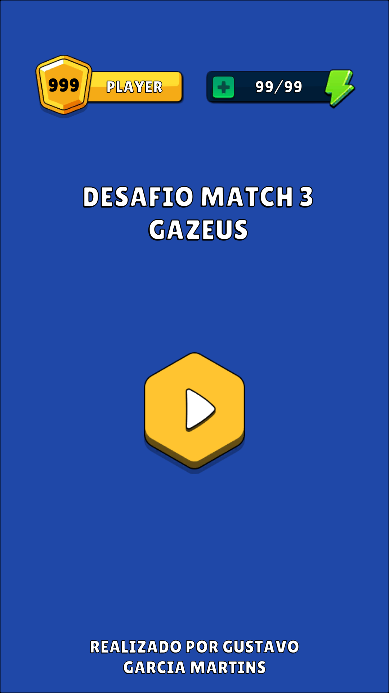
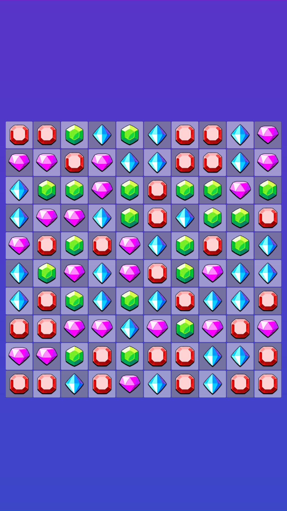
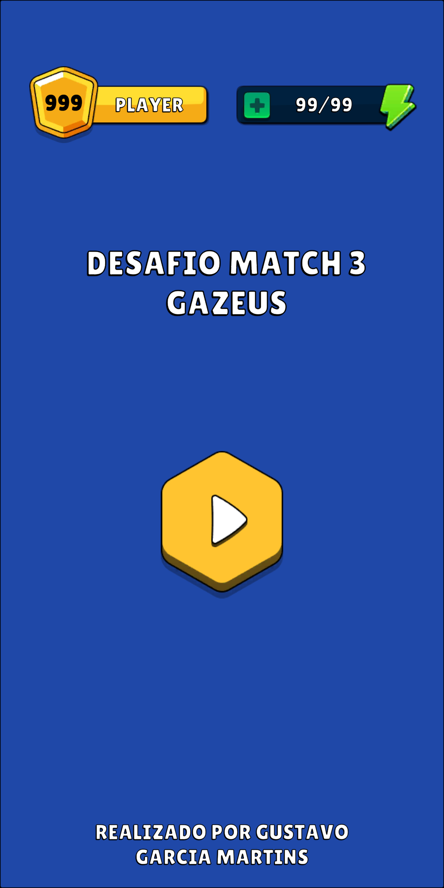
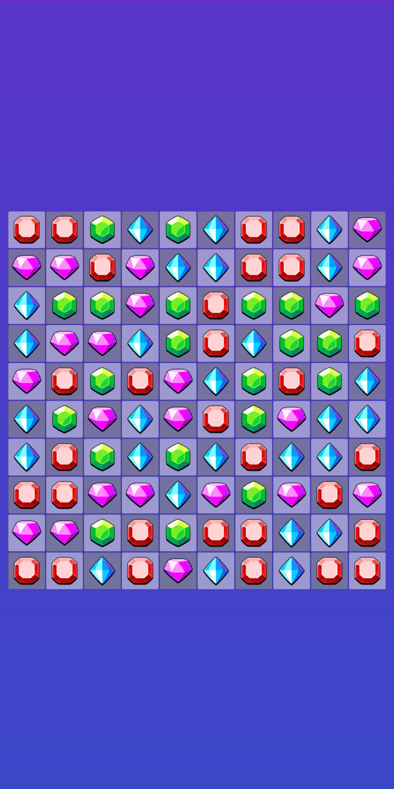
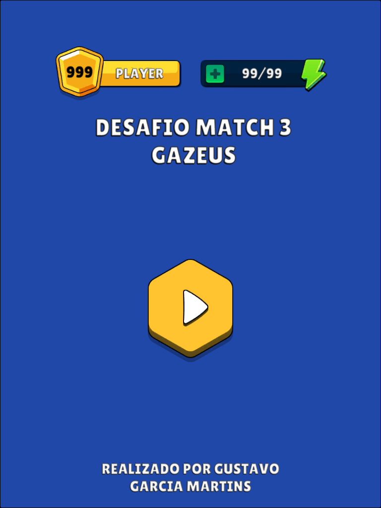
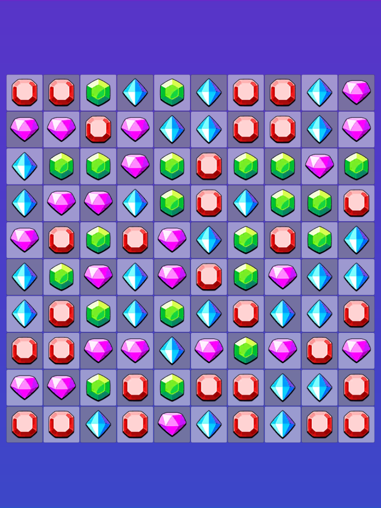

# Desafio Match-3 | Tech Artist

Projeto desenvolvido para o desafio técnico da Gazeus Games. A base recebida já possuía a lógica principal de match-3; a
entrega expande a experiência visual, adiciona tela inicial, transições, efeitos com Shader Graph e Particle System,
peças especiais, animações de reação em cadeia, melhorias de responsividade e testes de regras críticas.

## Versão

- Unity: `6000.3.16f1`
- Branch de entrega: `gustavogmartins-tech-artist-test`
- Cenas no build: `Assets/Project/Scenes/Home.unity` e `Assets/Project/Scenes/Gameplay.unity`

## Objetivos Atendidos

| Objetivo do teste                                    | Implementação                                                                                                                                                                                                      |
|------------------------------------------------------|--------------------------------------------------------------------------------------------------------------------------------------------------------------------------------------------------------------------|
| Tela de menu com transição para o jogo               | Cena `Home`, botão de play, fade entre cenas e entrada com fade na cena de gameplay usando `SceneFaderController`.                                                                                                 |
| Interface adaptável a diferentes resoluções          | Ajuste automático do tamanho das células do tabuleiro em `BoardView.OnRectTransformDimensionsChange`, além de ajustes de header e layout para 16:9, 18:9 e 4:3.                                                    |
| Efeito com shader                                    | `DissolveShaderGraph` aplicado no desaparecimento das peças via `TileDissolveView`; `BackgroundGradientGraph` compõe a identidade visual do fundo; `ParticleAdditiveGraph` apoia materiais aditivos de partículas. |
| Efeito com Particle System                           | Prefabs `DestroyTileVFX`, `SpecialTileVFX` e `BombExplosionVFX`, controlados por pool para evitar instanciação repetida durante cascatas.                                                                          |
| Efeito diferenciado para matches com mais de 3 peças | Matches de 4 criam peças especiais de linha/coluna; matches de 5 ou mais criam bomba 3x3. A bomba possui pulso, shake do board, VFX central e reação escalonada nas peças afetadas.                                |
| Bônus: estilo artístico consistente                  | Novos sprites, fontes, materiais, atlases, cores de tile, highlight de seleção e tratamento visual coerente entre menu e gameplay.                                                                                 |
| Bônus: cascatas e performance                        | Resolução de ondas no `GameService`, animações sequenciais no `GameController` e object pooling para tiles e VFX em `BoardView`.                                                                                   |

## Como Executar

1. Abra o projeto no Unity `6000.3.16f1`.
2. Abra a cena `Assets/Project/Scenes/Home.unity`.
3. Pressione Play.
4. Clique no botão de play para entrar na cena `Gameplay`.

Também é possível iniciar diretamente pela cena `Gameplay.unity` para testar mecânicas e VFX sem passar pelo menu.

## Controles

- Clique em uma peça para selecioná-la.
- Clique em uma peça adjacente para tentar trocar as posições.
- Trocas inválidas animam de volta.
- Peças especiais podem ser ativadas com duplo clique.
- Em Play Mode, a ferramenta `Tools > Debug Tools > SpecialTileCreationTool` permite criar especiais na peça selecionada
  para testar rapidamente linha, coluna e bomba 3x3.

## Estrutura Principal

```text
Assets/Project
|-- Art
|   |-- Gameplay_Elements       # Sprites de peças e especiais
|   |-- UI_Elements             # Elementos de interface e highlight
|   `-- SpriteAtlas             # Atlases de gameplay e UI
|-- Editor
|   `-- SpecialTileCreationTool # Ferramenta de debug/teste de especiais
|-- Fonts                       # Fonte Lilita One e materiais TMP
|-- Materials                   # Materiais de shader, partículas e UI
|-- Prefabs
|   |-- VFX                     # Destroy, special appear e bomb explosion
|   `-- *Tile.prefab            # Peças normais e especiais
|-- Scenes
|   |-- Home.unity
|   `-- Gameplay.unity
|-- Script
|   |-- Controllers             # Fluxo de jogo e transição de cena
|   |-- Core                    # Regras puras do match-3
|   |-- Models                  # DTOs, sequências e tipos de especiais
|   |-- ScriptableObjects       # Repositórios de prefabs e parâmetros de VFX
|   `-- Views                   # Board, tile spots, dissolve e VFX
|-- ScriptableObjects           # Assets configuráveis usados em runtime
|-- Shaders                     # Shader Graphs customizados
|-- Tests
|   `-- EditMode                # Testes automatizados da lógica de especiais
`-- Textures                    # Texturas auxiliares de partículas
```

## Arquitetura e Fluxo

O projeto separa a regra de jogo da apresentação. `GameService` concentra a lógica de tabuleiro, validação de
movimentos, detecção de matches, criação de especiais, ativação de efeitos especiais, cascatas, gravidade e refill. Ele
retorna listas de `BoardSequence`, que descrevem o que deve ser animado sem depender de objetos de cena.

`GameController` interpreta o input do jogador, bloqueia novas interações enquanto há animação em andamento, executa
swaps, ativa especiais por duplo clique e encadeia as etapas visuais retornadas pelo serviço.

`BoardView` materializa o estado visual: cria o grid responsivo, controla seleção, anima swaps, dissolve de peças,
criação de especiais, queda/refill e VFX. A view também mantém pools separados para tiles e partículas.

## Peças Especiais

| Condição                          | Especial criado   | Efeito                                                                                                        |
|-----------------------------------|-------------------|---------------------------------------------------------------------------------------------------------------|
| Match de 4 na horizontal          | `ClearHorizontal` | Remove a linha inteira.                                                                                       |
| Match de 4 na vertical            | `ClearVertical`   | Remove a coluna inteira.                                                                                      |
| Match de 5 ou mais                | `ClearArea`       | Remove uma área 3x3 ao redor da peça.                                                                         |
| Especial atingindo outro especial | Encadeamento      | O segundo especial é ativado; casos linha-linha e coluna-coluna alternam o eixo para aumentar impacto visual. |

A posição preferencial para criar o especial é a peça movida pelo jogador quando ela participa do match. Quando isso não
se aplica, o sistema usa a posição central do grupo.

## VFX e Shaders

- `DissolveShaderGraph`: dissolve progressivo das peças removidas.
- `TileDissolveView`: cria material de runtime por tile para animar `_DissolveAmount` sem compartilhar estado entre
  instâncias.
- `DestroyTileVFX.prefab`: partículas disparadas quando a peça termina o dissolve.
- `SpecialTileVFX.prefab`: efeito de aparição ao transformar uma peça normal em especial.
- `BombExplosionVFX.prefab`: VFX dedicado para a bomba 3x3.
- `BombEffectView`: componente reutilizável para pulso da bomba, shake do board, atraso do VFX central e reação das
  peças afetadas.
- `BombEffectParams`: ScriptableObject que parametriza timings do efeito da bomba sem alterar código.
- `PooledParticleVfx`: wrapper para reproduzir e devolver partículas ao pool quando todos os `ParticleSystem` terminam.

## Responsividade

O tabuleiro calcula o tamanho das células a partir do espaço real disponível no `RectTransform`, considerando padding e
spacing do `GridLayoutGroup`. Isso mantém células quadradas e evita cortes em resoluções diferentes.

As resoluções-alvo usadas como referência para validação visual são:

| Contexto      |   Resolução | Proporção |
|---------------|------------:|-----------|
| Mobile padrão | 1080 x 1920 | 16:9      |
| Mobile alto   | 1080 x 2160 | 18:9      |
| Tablet        |  1024 x 768 | 4:3       |

## Evidências Visuais

| Home 16:9                                                                                  | Gameplay 16:9                                                                                      |
|--------------------------------------------------------------------------------------------|----------------------------------------------------------------------------------------------------|
|  |  |

| Home 18:9                                                                                  | Gameplay 18:9                                                                                      |
|--------------------------------------------------------------------------------------------|----------------------------------------------------------------------------------------------------|
|  |  |

| Home 4:3                                                                                   | Gameplay 4:3                                                                                       |
|--------------------------------------------------------------------------------------------|----------------------------------------------------------------------------------------------------|
|    |    |

## Testes

Foram adicionados testes EditMode para as regras de especiais em
`Assets/Project/Tests/EditMode/GameServiceSpecialTileTests.cs`.

Cobertura principal:

- movimento envolvendo especial é válido mesmo sem match normal;
- especial horizontal remove linha;
- especial vertical remove coluna;
- bomba remove uma área 3x3, respeitando os limites do tabuleiro quando ativada nas bordas;
- match contendo especial ativa o especial;
- especiais encadeados ativam outros especiais;
- gravidade, refill e resolução de matches restantes após especial;
- criação manual de especiais por código;
- casos inválidos não alteram o board.

Como executar:

1. Abra `Window > General > Test Runner`.
2. Selecione `EditMode`.
3. Rode `GameServiceSpecialTileTests`.

Opcionalmente, via linha de comando:

```powershell
Unity.exe -batchmode -projectPath . -runTests -testPlatform EditMode -testResults TestResults/EditModeResults.xml -quit
```

## Observações de Entrega

- A solução prioriza separação entre regra e visual para facilitar teste automatizado.
- Os VFX usam pooling para reduzir garbage collection e custo de instanciação durante cascatas.
- Os materiais de dissolve são instanciados em runtime para evitar que várias peças compartilhem o mesmo `_DissolveAmount`.
- Os principais sprites de gameplay e UI foram organizados em Sprite Atlases para reduzir chamadas de renderização e manter o projeto navegável.
- A ferramenta de editor foi incluída como suporte para teste e debug, não como mecânica de gameplay.
- Assets visuais foram adquiridos através no pacote [GUI Pro Casual Game](https://www.gamedevmarket.net/asset/gui-pro-casual-game). 
- Mais informações sobre a licença estão disponíveis em [Pro license](https://www.gamedevmarket.net/terms-conditions#pro-licence).
